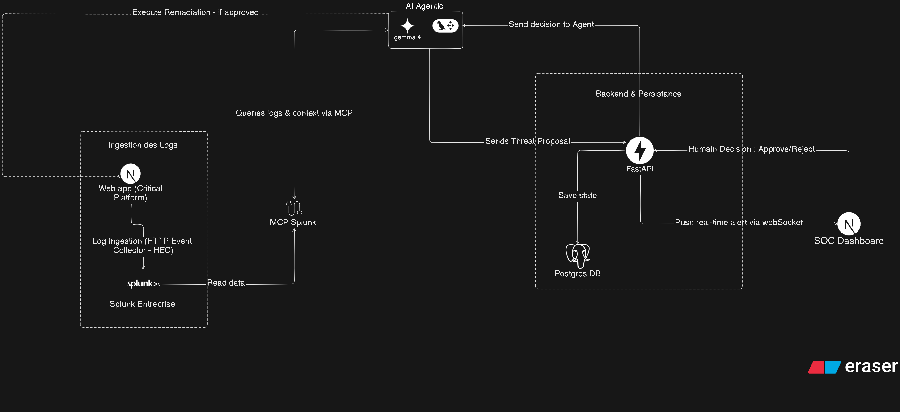

# SAO-CP

## Inspiration

In critical environments like university hospitals (CHU), medical record platforms are prime targets for cyberattacks. Security teams face a difficult dilemma: manual log analysis is too slow to react to modern threats, but giving full autonomy to an AI to block threats is too risky. A false positive from an autonomous AI could accidentally lock out a doctor from a life-saving patient file during an emergency. SAO-CP was born from this exact need: creating a security model where the speed of AI meets the wisdom of human judgment.

## What it does

SAO-CP is a security operations platform that protects a healthcare document system by integrating an AI agent under strict human supervision. It operates through a clear 5-step workflow:

1. **Generation & Capture:** Medical staff interact with the patient record platform. Every action generates logs that are streamed in real-time to Splunk.
2. **Agentic Analysis:** An AI agent, connected to Splunk via the MCP protocol, continuously monitors these logs. If it detects an anomaly (e.g., unusual data exfiltration), it analyzes the context.
3. **Action Proposal:** Instead of acting blindly, the agent formulates a remediation recommendation (e.g., "Block User IP" or "Revoke Session").
4. **Human Supervision:** The alert and the agent's proposed action appear on a dedicated SOC Dashboard for security analysts. The analyst sees exactly _why_ the AI wants to act.
5. **Validation & Execution:** The human always has the final say. With a single click, the analyst gives the green light or cancels the action. The agent only executes the remediation task after this explicit validation.

## How we built it

We are building a clean, highly structured MVP based on a 4-layer architecture:

- **Target Application:** A web application built with **Next.js** that simulates a medical document platform. It emits event logs in JSON format.
- **Splunk Enterprise:** The core engine. It ingests the target app's logs, stores them, and allows the AI to query them using SPL.
- **AI Agent & Splunk MCP:** Developed with LangChain in **Python**, the agent leverages the **Splunk MCP Server** to natively interact with Splunk, search for anomalies, and formulate context-aware suggestions. Agent states and decisions are persisted in a **PostgreSQL** database.
- **SOC Dashboard & Backend:** A **Next.js** frontend coupled with a **FastAPI** backend. FastAPI orchestrates the communication between the agent, the database, and the frontend via **WebSockets** to display alerts in real-time and capture the analyst's validation.

## Architecture

